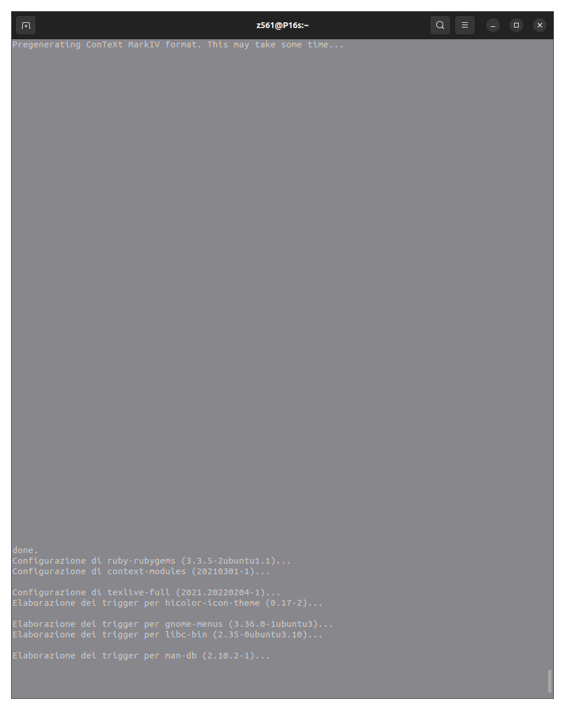
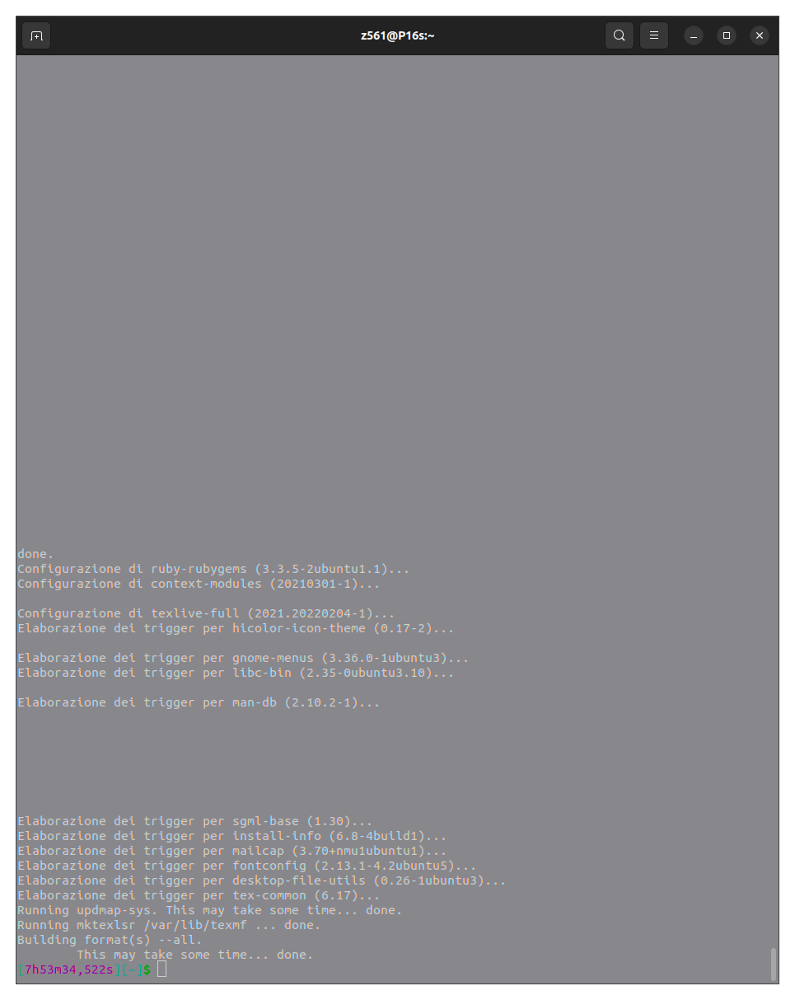
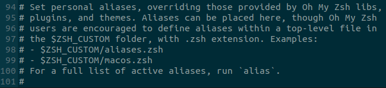
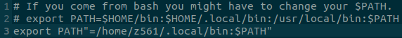
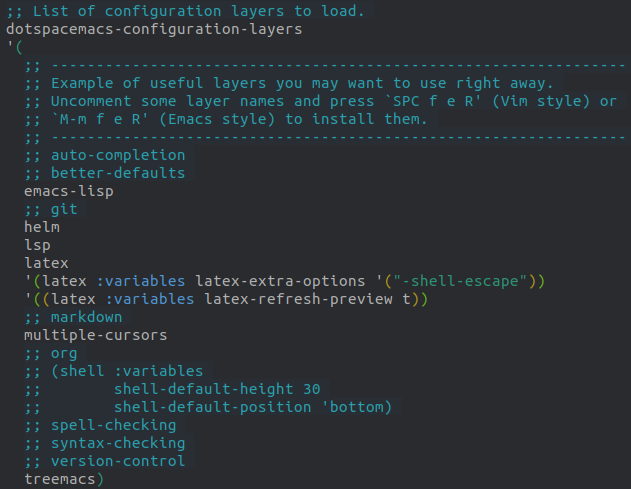
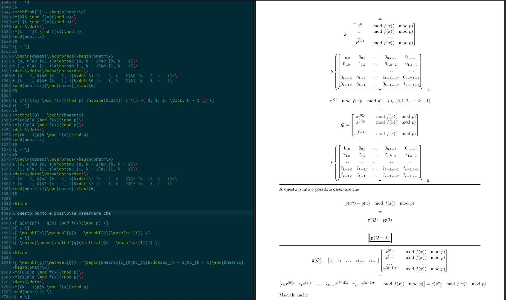

# Spacemacs for FREE LaTeX (scientific) documentation production

This is the complete introduction to install and use Spacemacs for FREE LaTeX documentation production in an Ubuntu environment.


Let's get to the point as quick as possible.

## Install TeX Live

The very first thing you'll ~always have to do if you want to create LaTeX projects on your computer is to download the enigmatic ```texlive-full``` through
```bash
sudo apt-get install texlive-full
```
Don't get me wrong, you could still achieve some working solution without downloading ~7GB data package, but, if you don't want to always worry about lacking dependencies you should definitely install it. Now, if you have Ubuntu (I have 22.04 LTS and STILL, after many years, this "bug" is present) you'll probably face the cursed ```Pregenerating ConTeXt MarkIV format. This may take some time...```. If your installation goes fine then you won't have to solve. If not, then ```This may take some time...``` means ```This may take some eternities...```. Now, for some arcane reason you'll have to keep your ```ENTER``` button pushed down until it solves. There's been someone in the past who probably destroyed his keyboard doing this and solving by brute force.




## "Install" Spacemacs

Spacemacs is not really a program on its behalf; it's more like a infinite-power-up-customization of the great old Emacs. Since EVERY Ubuntu distro, up to 2025, has it preinstalled you might guess you'll just need to install Spacemacs config file through
```bash
git clone https://github.com/syl20bnr/spacemacs ~/.emacs.d
```
and run ```emacs``` (because ```emacs``` reads the config file at the directory shown above at runtime and "behaves accordingly"). Indeed, this won't be enough ;'''D (but you still have to run the previous command and clone the repo ofc). The problem is that the last version of Spacemacs requires Emacs v28.2, and Ubuntu 22 LTS has v27.1 installed. If you use ```apt-get``` you won't get the desired outcome, because ```apt-get``` only downloads very stable versions, and v28.2 is not recognised as one.

Now, I SUGGEST to install the version 30.2 through
```bash
sudo snap install emacs --classic
```
Please, don't make the same error I made and think this will install the stable version of Emacs stopping the process, just let it download, otherwise it will be painful to solve.

Alright, now you have v30.2>v28.2 which should be fine (it is). Now, if you run ```emacs``` you (guess what) won't get the desired outcome because the ```emacs``` version you downloaded is located at ```/snap/bin/emacs```, while the other version is located at ```/usr/bin/emacs``` and overrides the new version. In order to be able to solve this problem permanently, you'll have to head to ```~/.bashrc``` if you use ```bash```, or to ```~/.zshrc``` if you use ```zsh``` or ```OhMyZsh``` like I do. Now, edit the file with ```nano``` or whatever you use to edit files and put the following line into it
```bash
alias emacs='/snap/bin/emacs'
```
then save, and run ```source ~/.bashrc``` or ```source ~/.zshrc``` to reload. This will redirect the ```emacs``` command to the right binary. Now, finally, run ```emacs```, and you'll be projected into the Space(macs). Set a couple of configurations (trivial, I suggest Vim [evil] mode) and let Spacemacs download some planets.

### How it should be done for OhMyZsh

Heading to the very end of ```~/.zshrc```, you'll see there's a clear note on how it should be made.



Now, if you take a look at ```env```, you'll realize ```$ZSH_CUSTOM``` hasn't really been set. I'm not sure how this works, but it's simple in this case to imagine that ```OhMyZsh``` software take a look at alises defined at ```$ZSH/custom/aliases.zsh```. Heading to ```~/.oh-my-zsh/custom``` folder you can see there's not a file named ```aliases.zsh```, then, we simply create it through
```bash
echo "alias emacs='/snap/bin/emacs'" > aliases.zsh
```
obtaining a clean modification. Now run ```emacs``` or (if it doesn't work) quit terminal then run ```emacs``` and you should be projected into the Space.

## Another couple downloads before using Spacemacs

In order to print state of art syntax highlighted codes you'll definitely need the package ```minted```. Now, this package has created many problems with the TeX project because it relies on external dependencies while being the best way to print code in an easy and perfect way. Run
```
sudo apt-get update && sudo apt-get install python3 python3-pip
```
then
```
pip install Pygments
```
Now, in order to allow Spacemacs recognise ```pygmentize```, which is the binary executable needed to perform package ```minted``` related magics, we'll need to associate it to the ```$PATH``` environment variable. Insert
```
export PATH"=/home/Your_Fancy_Name/.local/bin:$PATH"
```
inside your ```~/.bashrc``` or ```~/.zshrc``` file. I give you an example below based on my ```.zshrc``` file which is customized because I have ```OhMyZsh``` installed.



Now you should check where actually ```pigmentize``` is, to be sure of this one last command. To do so the best way is to install the life saver ```locate``` pack. Run
```
sudo apt install mlocate
```
Then run ```locate pygmentize```. Check the directory and if it's different change it in the ```$PATH``` variable inside ```.zshrc``` or ```.bashrc```.

Now another installation is not R_E_Q_I_R_E_D but it's likely helpful, and since my actual solution is working and I have this installed, I suggest you to do the same, but this is up to you. Install ```rust``` compiler and stuff, along with ```cargo``` (package manager for ```rust``` projects) running
```
curl --proto '=https' --tlsv1.2 https://sh.rustup.rs -sSf | sh
```
then run
```
cargo install --git https://github.com/latex-lsp/texlab
```
This last one is an helpful solution mentioned at [https://www.spacemacs.org/layers/+lang/latex/README.html#lsp].

## Pre-create a good directory structure for your LaTeX project

I have to be completely clear with you here. I suggest you to start from Overleaf, copy some structure for your project in a simplified manner, handle it and write something (learn how to do LaTeX stuff), then, when your project is growing and you feel like Overleaf is not enough, or you just don't want to pay 🤑, or you just want to own your project or whatever, come back here. By the way, a good structure is easily obtainable replicating something like
```
your-project/
├── main.tex
├── chapters/
│   ├── chapter1.tex
│   ├── chapter2.tex
│   └── ...
├── sections/
│   ├── introduction.tex
│   └── conclusion.tex
├── figures/
│   ├── diagram.pdf
│   └── plot.png
├── tables/
│   └── results.tex
├── bibliography.bib
├── minted-cache/
├── build/
├── .gitignore
└── README.md
```

## Configure Spacemacs to be able to use LaTeX

Spacemacs allows to do infinite many things with files and things I can't even imagine. Since it's an OG software it has been created to be used without the help of the cursor. **Every single function you use is addressed by some keystroke.** This creates some misunderstandings at first, take your time. Once you are comfortable, press the sequence ```SPC f e d``` [ ```SPC``` = spacebar ] to open the Spacemacs configuration file through the Spacemacs interface. Navigate through the file and reformat its content like this



(to insert text you'll have to press ```i```, insert text, then press ```esc``` [ the button ``ESC`` ]). Now save the file with ```SPC f s```, then, reload the configuration with ```SPC f e R```. This last command will make Spacemacs download the LaTeX package etc. (let it do its magic).

## Tell Spacemacs to handle your project as a project

Create a ```.projectile``` file inside your main folder (```/your-project/```) running
```
touch .projectile
```
End of the story.

## Making the real magic

Now, it's not really important that Spacemacs recognise your project as such, but it's quite helpful because in that case you'll see it listed on the Spacemacs homepage, which is useful. If you see Spacemacs doesn't recognise it as such, don't worry it will by itself. Now, the important part. Head to ```/your-project/main.tex``` by running ```SPC f f``` (search it and press ```ENTER```). Now, run ```C-c C-a``` (where ```C-``` = ```CTRL```). This will make Spacemacs to do some magic. Don't worry about 4738275273 errors you see, it's fine ;'''DDD. Now, re-run the same sequence. Keep an eye at prompts saying if bibliography is ok, etc. Run it like 3 times (should def be enough). Now, head to ```/your-project/``` from terminal and run 
```
pdflatex --shell-escape -synctex=1 -interaction=nonstopmode main.tex
```
This last command is like an hidden gem, trust me. Now, either run ```C-c C-v``` or ```evince main.pdf``` and look at what we made 🥹.

For what concerns the project stuff; Spacemacs after some operations should def recognise your folder as a LaTeX project by itself. You'll be sure about this if you see your project directory listed into the "projects" section in the Spacemacs homepage. This is helpful because you can head to any project directory in a comfortable manner by running ```SPC p p``` and chosing from results.

## Another couple important notes

When dealing with complex formulas, real-time previews of ```pdf``` rendering is so valuable that not having such feature is a big handicap. Now, theoretically, Spacemacs should incorporate such feature, BUT, the whole implementation I gave you is fuckin broken, and barely works as a miracle. So, previews won't work (at least for me). It turns out that the best workaround for this, is to use [https://latexeditor.lagrida.com/] for complex formulas, then copy paste them.

Once we start making satellites solution, another quick realization is that we could use ```gedit``` instead of Spacemacs to actually perform modifications to files. This is because even though Spacemacs is actually made to edit files in the best way possibile, it requires time to learn every shortcut, and: (this are the worst things for me) it's really slow when we scroll the file up and down, and it's a little bit too zoomed (I'm pretty sure this might be customized). If we open files with ```gedit``` and make our modifications splitting the screen in half where we keep in the right part the compiled ```pdf```, we obtain an experience which is basically the same as the one we'd get with Overleaf but with some handicaps (of course), being:

- slowed compilation process (we must run ```C-c C-a``` ```C-c C-a``` ```C-c C-a``` then ```pdflatex --shell-escape -synctex=1 -interaction=nonstopmode main.tex``` from terminal to obtain a full compilation, but not every time 🌝)
- slowed operations on formula (due to navigation to ```https://latexeditor.lagrida.com/``` back and forth)

The second one of the two is not really a problem, since (once you are pro at writing formulas) you'll just use it for complex one, and anyway is not much time consuming. The first one is not a big problem because we'll need to perform a full compilation only if we need to compile bibliography and references which is something we can postpone or just not perform everytime. In every other case we'll just need to run
```
pdflatex --shell-escape -synctex=1 -interaction=nonstopmode main.tex | evince main.pdf
```

Below, an example of screen splitted to work on the project using ```gedit```.



