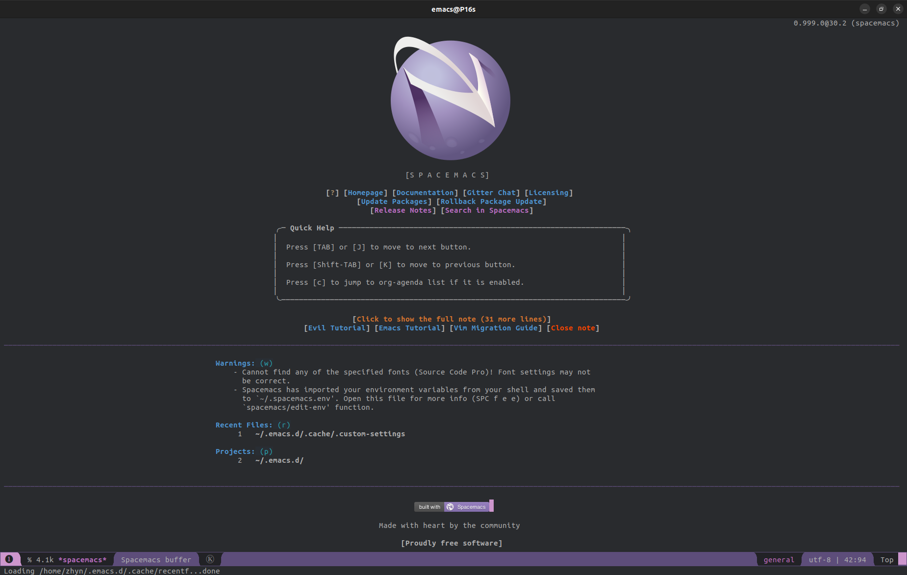

# Spacemacs for FREE LaTeX documentation production

This is the complete introduction to install and use Spacemacs for FREE LaTeX documentation production in an Ubuntu environment.

Overleaf platform has privatized LaTeX documentation production through the use of their service. Don't get me wrong, I have NOTHING against Overleaf team, since Overleaf is a GREAT service and it's fair to pretend a payment based on its usage. BUT, LaTeX has been created as an open source project FOR HUMANITY, and so, THERE MUST BE A WAY TO GENERATE SCIENTIFIC DOCUMENTATION FOR FREE. Print this last statement on your soul please.

Fortunately, this is still possible thanks to Spacemacs and its awesome team of community mainteiners. 



Let's get to the point as quick as possible.

## "Install" Spacemacs

Spacemacs is not really a program on its behalf; it's more like a infinite-power-up-customization of the great old Emacs. Since EVERY Ubuntu distro, up to 2025, has it preinstalled you might guess you'll just need to install Spacemacs config file through
```bash
git clone https://github.com/syl20bnr/spacemacs ~/.emacs.d
```
and run ```emacs``` (because ```emacs``` reads the config file at the directory shown above at runtime and "behaves accordingly"). Indeed, this won't be enough ;'''D. The problem is that the last version of Spacemacs requires Emacs v.28.1, and Ubuntu 22 LTS has v27.1 installed. Thus, if you use ```apt-get``` you won't get the desired outcome.

Now, I SUGGEST to install the version 30.2 through
```bash
sudo snap install emacs --classic
```
Please, don't make the same error I made and think this will install the stable version of Emacs stopping the process, just let it download, otherwise it will be painful to solve.

Alright, now you have v.30.2>28.1 which should be fine (it is). Now, if you run ```emacs``` you (guess what) won't get the desired outcome because the ```emacs``` version you downloaded is located at ```/snap/bin/emacs```, while the other version is located at ```/usr/bin/emacs``` and overrides the new version. In order to be able to solve this problem permanently, you'll have to head to ```~/.bashrc``` if you use ```bash```, or to ```~/.zshrc``` if you use ```zsh``` or **OhMyZsh** like I do. Now, edit the file with ```nano``` and put the following line into it
```bash
alias emacs='/snap/bin/emacs'
```
save, and run ```source ~/.bashrc``` or ```source ~/.zshrc``` to reload. This will redirect the ```emacs``` command to the right binary. Now, finally, run ```emacs```, and you'll be projected into the Space(macs). Set a couple of configurations (trivial, I suggest Vim [evil] mode) and let Spacemacs download some planets.

## Configure Spacemacs to be able to use LaTeX

